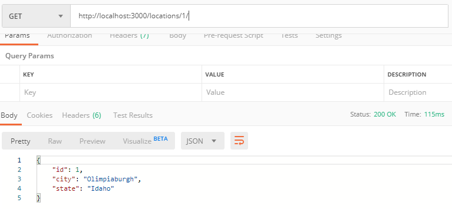
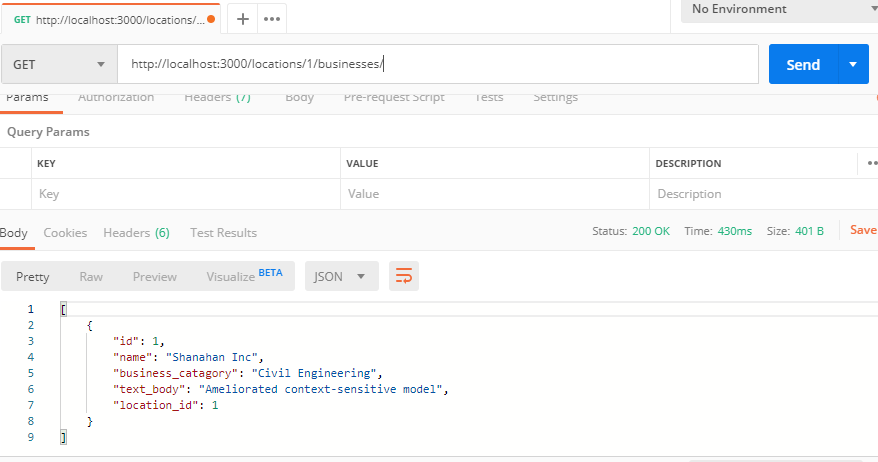

# _Business Lookup API_

Demonstrates GET functionality & routing with a Ruby on Rails API. The database is designed to store any number of businesses with a single location.

The location<br/><br/>


The business at that location (by location_id)<br/><br/>


<br/>

### Setup & Deployment

To test or run on your machine, follow the step-by-step instructions provided below.

```

Open and type "bundle install".

Create a database by typing "rails db:create".

"rails db:migrate" to finish creating the database.

"rails db:seed" to populate the database.

"rails s" to run the server.

```

### Next, you need to install Postman to handle the API requests. 

#### Download here: https://www.getpostman.com/

```

Postman handles the API, so type http://localhost:3000/locations into the input bar.

Run a GET request, you should see a list of locations.

Experiment with the API by navigating to http://localhost:3000/locations/"ID GOES HERE"/businesses. Or, view an individual location with http://localhost:3000/locations/"ID GOES HERE".

```

## Built With

* [Ruby](https://www.ruby-lang.org/en/)
* [Ruby on Rails](https://rubyonrails.org/)
* [PostgreSQL](https://www.postgresql.org/)

## Authors

* **Josh Horgen**

## License

Open source (c) 2019 Josh Horgen

This project is licensed under the MIT License - see the [LICENSE.md](LICENSE.md) file for details
